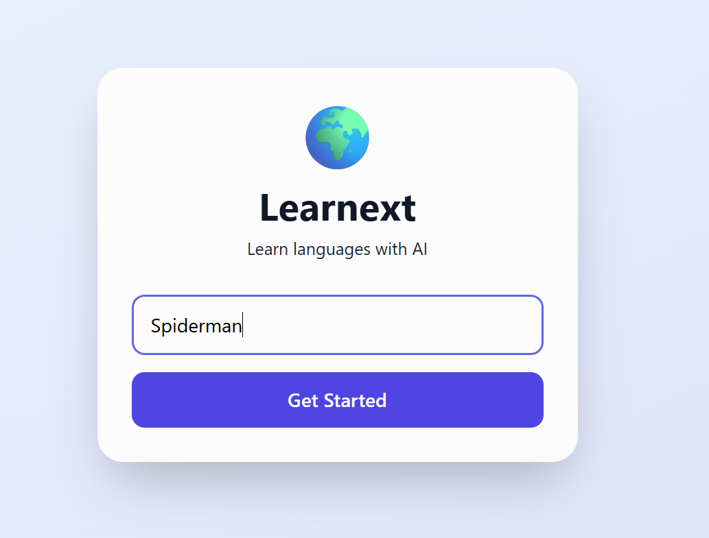
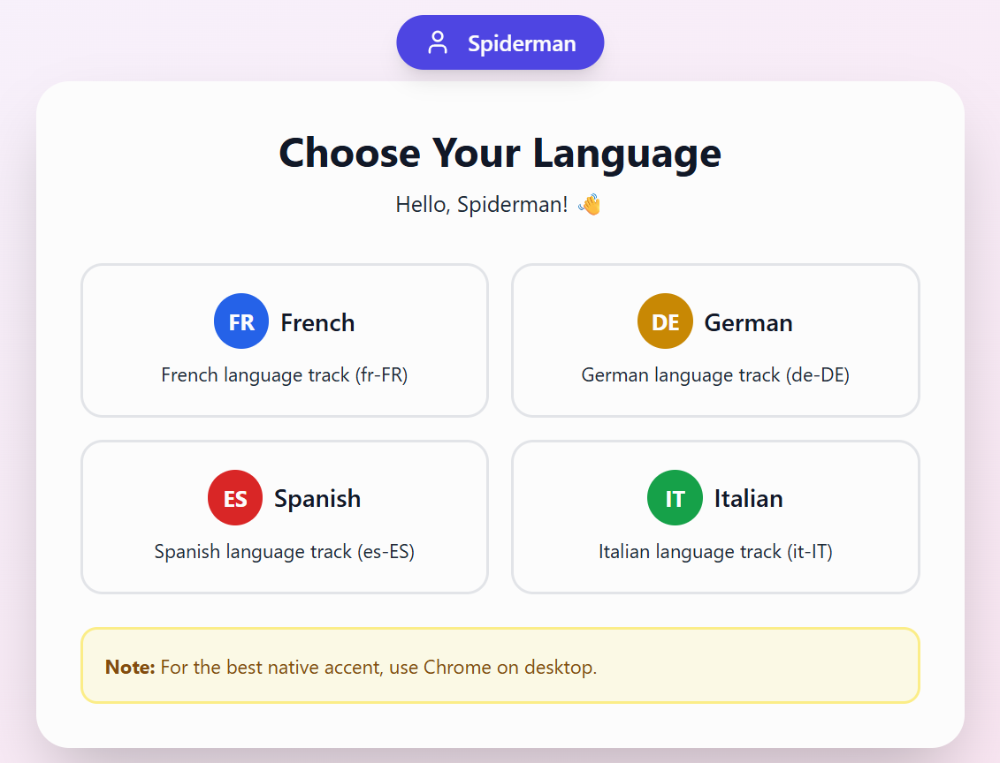
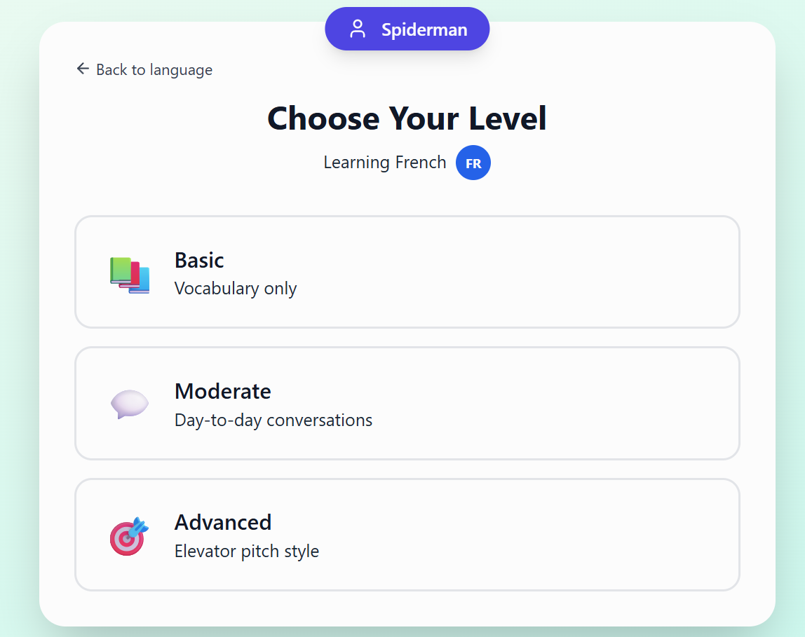
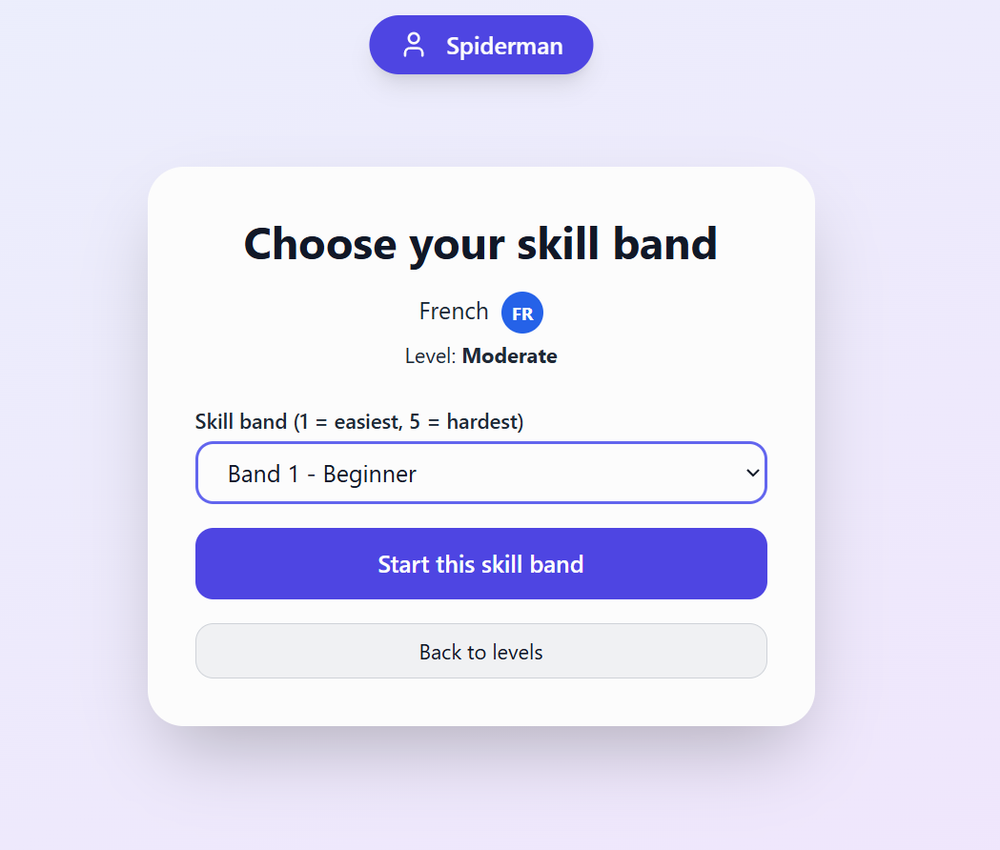
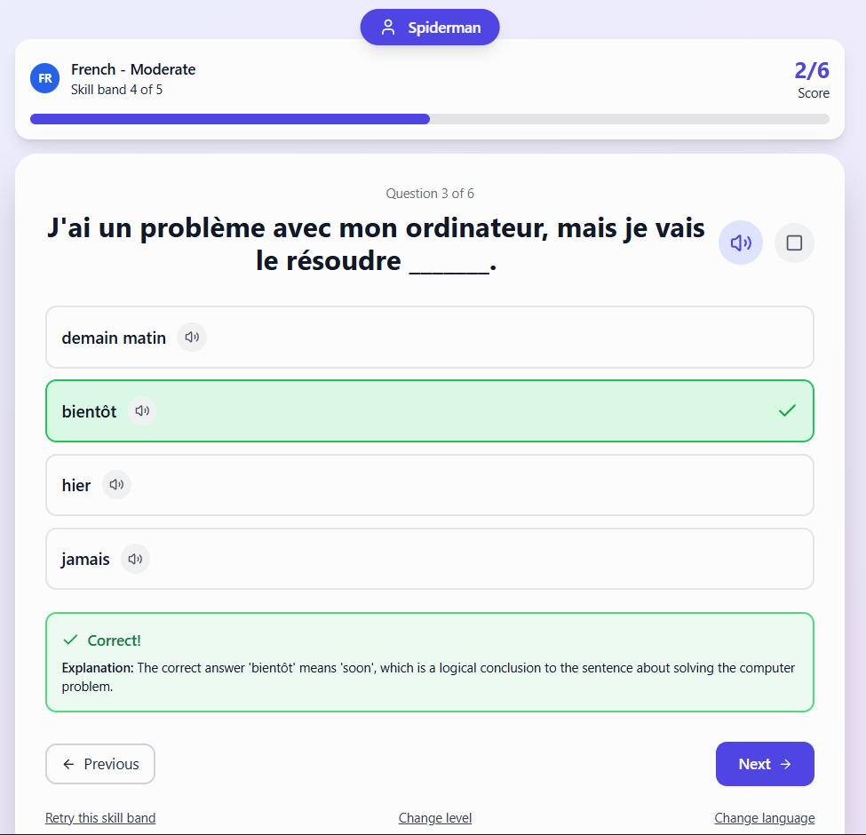
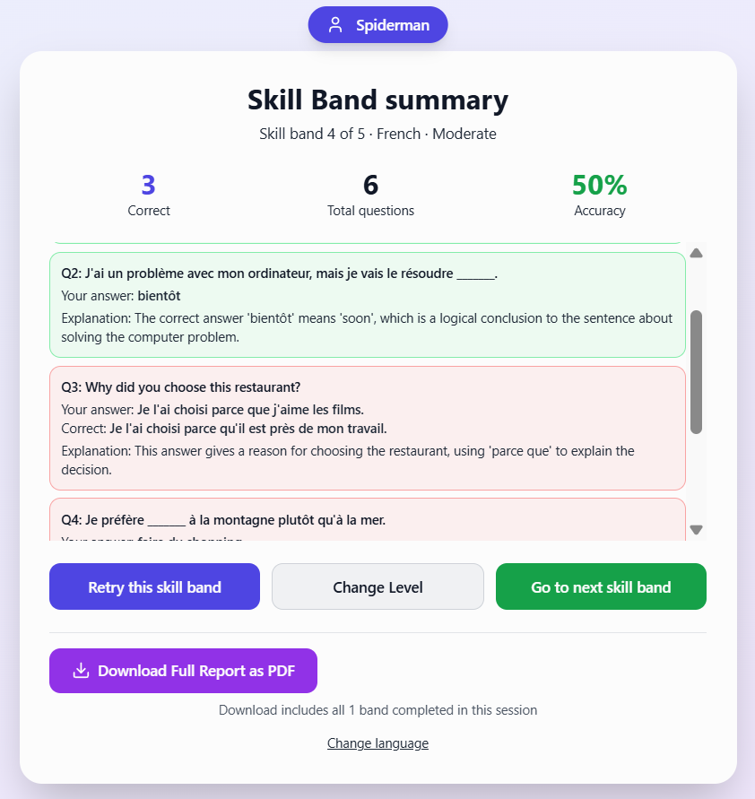

# Learnext AI Language Tutor MVP

Duolingo-style practice loops powered by real-time LLM generation, with explanations and a downloadable PDF practice report.

Live app: https://ai-tutor-mvp-pi.vercel.app/  
Case study: https://shubhamdahat.substack.com/p/learnext-ai-language-tutor-mvp  
PRD: https://docs.google.com/document/d/1jDDq-Z5xjeud4l5ORN_BeDNxUT_ESRhfXZLeVwSN7fg/edit?usp=sharing

## User journey
Enter any username → Pick a language → Choose a level → Select a skill band → Complete 1 band → Download PDF report

## Why this exists
Most language apps do a great job at habit and progression, but learners still hit gaps when they want:
- fresh, non-repetitive practice sets on demand
- short sessions that match intent (vocab, day-to-day, professional)
- explanations every time, not just correct or incorrect
- a session artifact they can keep or share (PDF report)

This MVP is built as a portfolio-grade proof of end-to-end AI product execution: schema design, prompt constraints, validation, UX iteration, and deployment.

## Key features
- 4 languages: French, German, Spanish, Italian
- 3 levels: Basic, Moderate, Advanced
- 5 skill bands per level (increasing difficulty)
- Question types
  - multiple choice
  - type-answer
  - fill-in-the-blanks (question + options in target language, explanation in English)
- Instant feedback (visual + sound) and short explanation for every question
- Band summary and full session report
- Downloadable PDF report generated from session data (not a screenshot)

## What makes it AI
Learnext generates fresh practice sets per band and returns structured JSON (questions, options, answers, explanations) that is validated before rendering.

## Tech stack
- UI: Next.js (App Router) + TypeScript + Tailwind CSS
- Backend: Next.js API routes
- LLM: Groq API for fast inference
- Deployment: Vercel
- Build acceleration: Claude coding for drafting and refactors, with PM-led iteration and validation

## Architecture
UI (app/page.tsx)  
→ POST /api/questions  
→ Groq LLM (prompt + JSON schema)  
→ Validation + normalization  
→ UI renders band set  
→ Session report + PDF export

## Screenshots
Landing screen-Enter any Username

Language selection  

Level selection  

Skill selection

Question feedback with explanation  

Full report and PDF download  

## Run locally
1) Install dependencies
npm install

2) Create .env.local in the project root and add:
GROQ_API_KEY=your_key_here

3) Start dev server
npm run dev

Open http://localhost:3000

## Notes on generation quality
This product treats the prompt as a specification.
- Basic stays vocabulary-focused
- Advanced pushes longer, more nuanced phrasing
- Outputs must follow strict JSON
- Explanations are always included, even when the answer is wrong

## Roadmap
Phase 2
- higher-quality multilingual voice with natural native accents
- speaking practice with transcription + feedback
- role-play scenarios (travel, work, interviews)

Phase 3
- avatar-based tutors with voice-first interaction and later video

## License
All rights reserved. Shared for portfolio review purposes only. Please contact me for permission to reuse or redistribute.
